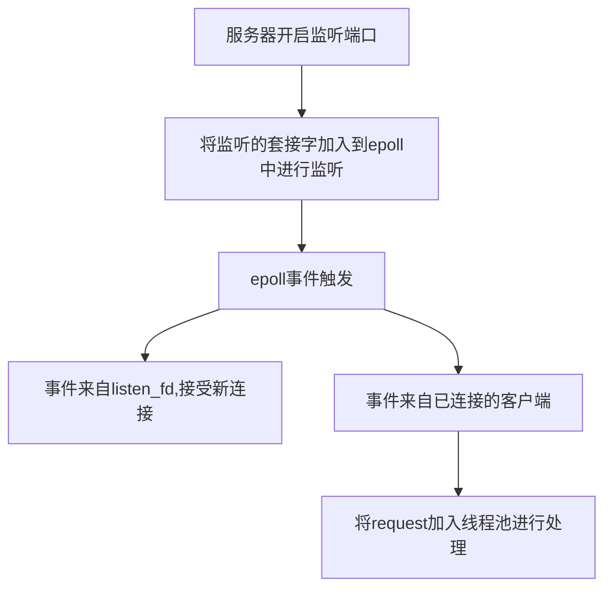

### **RAILGUN WEB SERVER**

注意：文中的部分函数因为参数部分过长，为了方便起见我已省略，不代表函数没有参数。

原项目地址：https://github.com/zyearn/zaver.git

---

[TOC]

#### **Run**

Make sure you already have installed gcc/g++ compiler and cmake tool.

1. `mkdir build && cd build`
2. `cmake ..`
3. `make all`

#### **diagram**



#### **main**

主函数位于zaver.c文件中，初读时，由于作者运用了大量的我前所未见的c库函数，所以看得比较吃力。

**```getopt_long()```**

首先main函数需要读入一些参数，作者利用```getopt_long```函数来进行读取命令行参数。参数格式为```Vc:?h```，说明-c参数后面必须要加内容，其他的参数不需要加。

```-c```用于读取配置文件，将该参数的指向一个配置文件路径。作者默认的配置文件内容包括了一个HTML文件，服务器的监听端口和线程数量。

**```debug()```**

然后是一个debug的函数，这其实是作者定义在debug.h文件中的一个宏，但是作者没有遵守规范用大写字母命名，给人造成一定的误导。debug.h文件中的内容分在下面讲述，点击[debug.h](####**debug.h**)跳转。

**```sigaction()```**

```sigaction()```用于给信号注册处理函数，该函数的参数中有一个与函数同名的结构体，结构体中就包含有处理函数。具体用法请见这篇[博客](https://www.cnblogs.com/wblyuyang/archive/2012/11/13/2768923.html)。作者用该函数来监视通信管道的破裂。通過将处理函数设置为SIG_IGN（对信号予以忽略）忽略pipe破裂时的信号，防止因为Pipe破裂而程序退出。

`open_listenfd(int port)`

定义在`util.c`中，是对于创建socket，绑定socket与地址以及进行监听等一系列步骤的一个封装。

`make_socket_non_blocking(int fd)`

将socket设置为非阻塞状态，防止进程一直阻塞在socket的读取，这对于高性能服务器编程必不可少。

```rg_epoll_create()```

该函数调用```<sys/epoll.h>```中的API创建一个epoll instance，初始时监视的文件描述符数量为0。然后通过`rg_epoll_add`函数将`listen_fd`加入epoll监听集合中。之所以这么做是因为epoll需要同时监听与其通过accept接收到客户端的套接字。

有一种普遍的epoll使用框架是这样的

```c
 for( ; ; )
    {
        nfds = epoll_wait(epfd,events,20,500);
        for(i=0;i<nfds;++i)
        {
            if(events[i].data.fd==listenfd) //有新的连接
            {
                connfd = accept(listenfd,(sockaddr *)&clientaddr, &clilen); //accept这个连接
                ev.data.fd=connfd;
                ev.events=EPOLLIN|EPOLLET;
                epoll_ctl(epfd,EPOLL_CTL_ADD,connfd,&ev); //将新的fd添加到epoll的监听队列中
            }
            else if( events[i].events&EPOLLIN ) //接收到数据，读socket
            {
                n = read(sockfd, line, MAXLINE)) < 0    //读
                ev.data.ptr = md;     //md为自定义类型，添加数据
                ev.events=EPOLLOUT|EPOLLET;
                epoll_ctl(epfd,EPOLL_CTL_MOD,sockfd,&ev);//修改标识符，等待下一个循环时发送数据，异步处理的精髓
            }
            else if(events[i].events&EPOLLOUT) //有数据待发送，写socket
            {
                struct myepoll_data* md = (myepoll_data*)events[i].data.ptr;    //取数据
                sockfd = md->fd;
                send( sockfd, md->ptr, strlen((char*)md->ptr), 0 );        //发送数据
                ev.data.fd=sockfd;
                ev.events=EPOLLIN|EPOLLET;
                epoll_ctl(epfd,EPOLL_CTL_MOD,sockfd,&ev); //修改标识符，等待下一个循环时接收数据
            }
            else
            {
                //其他的处理
            }
        }
    }
```

\<代码来自[epoll使用详解](https://blog.csdn.net/ljx0305/article/details/4065058)\>

即先调用`epoll_wait`阻塞进程，当有触发事件时，轮询事件中的文件描述符，如果是监听套接字，说明有新的连接进入。如果是其他的，说明已经连接的套接字中可读。

本项目也是这种结构，如果是`listen_fd`触发了事件，则接受请求，建立新的连接。如果是其他，则先检查是epoll出现错误，没有错误则说明该套接字有请求传输，则调用`do_request()`处理这些请求，`event[i].data.ptr`指向请求。

---

#### **debug.h**

前排提示，对于宏定义不清楚的同学在编译时可以选择只激活预处理，然后看宏是如何插入代码中的。

**```debug(M, ...)```**

首先该宏只有在开启了debug模式下才会定义，```#ifdef NDEBUG```

```c
#define debug(M, ...) fprintf(stderr, "DEBUG %s: %d: " M "\n", __FILE__, __LINE__, __VA_ARGS__)
```

注意M前面没有 # 符号，因为fprintf支持将多个多个字符串同时放入第一个参数的位置输出。如：

```c
printf("hello" "world");
```

注意两个字符串之间没有逗号，在输出时会自动将两个字符串连起来。

所以该宏函数的意思就是将某个文件中某一行的错误输入到标准错误stderr中。

在宏中，```...```表示可变长度参数。

常用预定义宏

```c
__FUNTION__  获取当前函数名 
__LINE__ 获取当前代码行号 
__FILE__ 获取当前文件名 
__DATE__ 获取当前日期 
__TIME__ 获取当前时间
__VA_ARGS__ 宏函数的可变长度参数
```

---

#### **util**

```open_listenfd(int port)```

根据端口创建套接字描述符和套接字地址，然后将套接字描述符和套接字地址进行绑定，利用listen函数进行监听。

当端口已被占有时，有个```setsockopt()```函数用于控制套接字选项打开地址复用。具体查看[博客](https://www.cnblogs.com/cthon/p/9270778.html)

```make_socket_non_blocking(int fd)```

通过文件描述符控制函数```fcntl()```将socket描述符设置为非阻塞。

`read_conf`

读取配置文件，易懂。

---

#### **priority_queue**

priority_queue算是所有源文件中最难懂的一个，有不少莫名的数据结构和算法以及不知所以的函数名。但是看懂了以后会惊叹于其中算法的高深之处。

在本项目中利用优先队列模板来处理timer和task。优先队列中的节点定义为

```c
typedef struct {
	void** pq;
	size_t nalloc;
	size_t size;
	pq_comparator_ptr comp;
} pq_t;
```

优先队列的优先级便定义在节点中的比较器——`pq_comparator_ptr comp`，比较器实质是函数指针——`typedef int (*pq_comparator_ptr)(void* pi, void* pj)`，传入的参数经过比较器的比较后，如果返回真，说明`pi`的优先级高于`pj`。

```void swim(pq_t* pq, size_t k)```

当插入新节点时会调用`swim`函数。不断地将k对应的值和k/2对应的值对比，如果比得过则交换位置。这样虽然新插入节点的优先级不一定是最高的，但是处于一个相对较高的水平，且这样插入节点的效率会更高，在对优先级不是特别要求严格的优先队列中可以使用此算法。

`size_t sink(pq_t* pq, size_t k)`

`sink`函数是为优先队列中的索引为k的节点找到真正的位置的函数。经过`swim`函数后，优先队列中的节点都是整体有序，但是部分无序。`sink`函数在找到这个小部分后再在这个小部分中逐个对比排序，这样重新定位后可以保证该节点在优先队列中前面的节点都比它高，后面的节点优先级都比它低。

这两个函数之所以叫`swim`和`sink`，是因为作者将寻找节点位置形象地描述为先游到一个大致的位置，然后`sink`下去寻找更加明确的位置。

`int pq_delmin(pq_t* pq)`

删除优先队列中最小的节点，即优先级最高的节点。方法是直接将最小节点与最后一个节点交换，然后最后一个节点sink。虽然优先队列是通过sink和swim来实现排序的，但是总能保证最前面的一个节点是优先级最高的。

`int pq_insert(pq_t* pq, void* item)`

插入新节点，直接将节点加到尾部，然后通过swim函数将节点移动到一个相对合理的位置。

`int pq_sink(pq_t* pq, size_t k)`

直接通过调用sink函数找到当前的索引为k位置的节点正确的位置。

---

#### **list.h**

`list.h`将会用于http请求中用于链接请求头部中的一系列键值对。

`#define OFFSET_OF`

该宏函数可以得到一个结构体中的各属性相对结构体的位置。通过将0转换为结构类型的指针，则该指针的起始地址就是`0x00`，再直接取该结构体的各属性地址就能直接得到该属性在结构体的起始位置。

```#define CONTAINER_OF```

这个宏函数的结构是一种C语言很少见的赋值语句，比如下面这种：

```c
int a = ({
    int b = 1, c = 3;
    c - b;
});//圆括号不能被省去，省去即报错
```

这段代码中a可以直接被赋值为c和d的差值。这个宏函数也是这样的结构

```c
#define OFFSET_OF(type, member) ((size_t)&((type*)0)->member);

#define CONTAINER_OF(ptr, type, member) ({
	const typeof( ((type*)0) ->member)* __mptr = (ptr);
	(type*)((char*)__mptr - OFFSET_OF(type, member));
})
```

将上面的`OFFSET_OF`的宏展开后为：

```c
(type*)((char*)__mptr - ((size_t)&((type*)0)->member));
```

超前看一下请求头部键值对的定义：

```c
typedef struct header_s {
    void *key_start, *key_end;
    void *value_start, *value_end;
    list_head* list;
} header_t;
```

在应用时，由于在遍历请求头部list时，指针始终指向结构体中的list属性，所以需要找到结构体开始的位置，通过将list指针的位置减去list属性在`header_t`中的偏移位置就能做到。

---

#### **rio**

为了实现更好的读写控制，作者对于系统调用的read和write函数做了一层封装。

首先作者定义了一个

```c
#define RIO_BUFFSIZE 8192
typedef struct {
    size_t rio_fd; //给rio_t读取内容的文件描述符
    ssize_t rio_cnt; //内部缓存还没有读的字节数
    char* rio_bufptr; //内部缓存指针
    char rio_buf[RIO_BUFSIZE]; //rio_t的内部缓存
} rio_t;
```

然后在```rio.c```文件中先定义了```rio_readn(int fd, void* buf, size_t n)```和```rio_writen(int fd, void* buf, size_t n)```两个函数，均是根据文件描述符往buf中读/写n字节的内容。

```static ssize_t rio_read(rio_t* rp, char* buf, size_t n)```

```rio_read```处于封装的中间层，函数首先判断rp内部缓存是否还有为读完的内容，是的话就先读到buf里面，直到读完。也不是真的读，而是通过```memcpy```的进行内存复制。

如果读完了，则利用read函数从```rio_fd```中读取内部缓存那么多的字节。再将内部缓存复制给用户读取的缓存`buf`。

```rio_init(rio_t* rp, int fd)```

对一个rp进行各种赋值。

```ssize_t rio_readnb(rio_t* rp, void* buf, size_t n)```

调用`rio_read`函数将一个已赋值的rp内部缓存中的内容读入buf中。

**Tip**: `rio_read`,`rio_readn`和`rio_readnb`的区别

由于系统调用read函数只能一次性地特定大小的内容到buf中，所以当要读取的内容很多时，需要有多个循环进行读取。由于这里有一层封装，所以需要多个函数来实现封装。

在`rio_read`内，有一层循环，保证能够读取n个字节的内容到buf中，前提是文件描述符中有足够的内容读取，如果不足则直接返回。

在`rio_readn`中，这里作者直接执行的系统调用read，而不是自己封装的`rio_read`，可能是发现根本没有必要。因为在buf足够大，文件描述符中内容足够多的话，read函数已经能够保证读取n字节的内容到buf中。但是`rio_read`和`rio_write`使用static修饰，可能在其他地方需要使用。

`rio_readnb`中，由于使用`rio`时准备的user_buf是随时在变化的，`rio_readn`只能保证读取一个user_buf的内容到其中，所以需要这个函数再进行一次循环，才能使user读取到需要的内容。

---

#### **threadpool**

首先介紹一下线程池用到的两个系统调用和系统线程类型。（常见的如线程的创建，销毁等就不讲了）

在多线程同步的问题中，常用的一种方法是互斥锁和条件变量的混合使用。


**互斥锁**

`pthread_mutex_t`：线程互斥锁结构体

`int pthread_mutex_init(pthread_mutexattr_t* mattr)`

线程锁初始化

`int pthread_mutex_lock(pthread_mutex_t* mutex)`

该函数用于对互斥锁进行上锁，如果互斥锁已经被锁定，说明资源已经被占用，则调用该线程将阻塞，直到互斥锁可用。

返回值：

* 0：成功

* EINVAL:参数中互斥锁还没有初始化
* EAGAIN:互斥锁无法取得，因为互斥锁的允许线程数量已经达到上限（有些资源允许多个线程共同获得）
* EDEADLK：当前线程已经拥有了互斥锁

`int pthread_mutex_unlock(pthread_mutex_t* mutex)`

对互斥锁进行解锁，当然前提是调用本函数的线程拥有这个互斥锁

返回值：

* 0：成功
* EPERM：当前线程不拥有互斥锁

**条件变量**

`pthread_cond_t`：条件变量结构体

`pthread_cond_init()`：条件变量初始化函数

`pthread_cond_wait(pthread_cond_t* cond, pthread_mutex_t* mutex)`：消费者得到互斥锁后发现条件不满足，需要利用该函数解锁互斥锁和等待条件变量。

`pthread_cond_signal(pthread_cond_t* cond)`：生产者将消费者唤醒

**threadpool内部函数**

**`threadpool_init()`**

首先初始化一个线程池结构体，对于`thread_count`、`queue_size`、`shutdown`和`started`等变量都赋值为0。然后通过malloc开辟一个指定数量的线程结构体`pthread_t`大小的空间。

线程池的`head`属性是一个带头结点（头结点只负责指引，属性均为NULL）的链表，而链表的类型是`task_t`，顾名思义就是链接一系列的线程需要执行的函数。

```c
struct task_s {
    void (*func)(void*);
    void* arg;
    struct task_s* next;
} task_t;
```

接着初始化线程池的互斥锁和条件变量。

然后就是为线程池中的各个`pthread_t`的线程结构体创建线程

创建线程的代码：`pthread_create(&(pool->threads[i]), NULL, threadpool_worker, (void*)pool)`

从上面的代码可知，每条线程被创建后都去执行`threadpool_worker`函数，参数即本线程池。创建线程的同时线程池中的线程数量属性和线程开始属性都相应加一。

**`threadpool_add()`**

这个名字会让人以为是往线程池中添加线程，实际是往线程池中添加task。比较好懂，不讲

**`threadpool_free()`**

将线程池中的所有`pthread_t`结构体free掉，前提是线程池存在且内存池中没有正在进行的线程。然后将`task_queue`中的所有`task_t`结构体也free掉。

**`threadpool_destory()`**

销毁线程池。先通过`pthread_cond_broadcast()`将阻塞在条件变量上的线程都执行，这时再对`mutex`进行加锁，如果不能成功，说明仍有线程正在占据锁。

否则通过`pthread_join()`验证每个线程是否已经正常执行完退出。最后对互斥锁和条件变量进行销毁。

**`pthread_worker()`**

前面提到在创建线程池时，每条线程创建后都会来前来执行`pthread_worker()`。形象一点说这是每条线程前来领任务的地方。在一个死循环内，线程会先得到线程池的锁，如果线程池没有任务或线程池已关闭的话，线程会陷入阻塞，阻塞时会打开互斥锁。

然后检查线程池是否要shutdown，如果有则进行shutdown。没有则执行任务，先从`task_queue`取下最前面的一个task，然后将互斥锁打开，接着线程就自己执行`task`对应的函数去了。执行完后将`task`释放，线程再进入循环领任务，直到线程池关闭，所有线程才会逐条退出。

**待优化点**：因为每个线程的创建都是零碎的，这样会导致内存的碎片化，不利于内存的利用。所以作者打算利用内存池来连续的使用一段内存进行线程的创建。

所谓内存池(Memory Pool)，即事先向操作系统申请一块很大的内存，然后程序在申请内存时就从这块内存中分配一小块，这样就能够减少内存碎片的产生。

更多信息可以查看这篇[文章](https://blog.csdn.net/imxiangzi/article/details/50953295)。

---

#### **epoll**

epoll是在Linux多路复用IO接口select/poll的增强版本，其最显著的优势就是IO效率不随文件描述符数量的增加而线性下降。

select/poll之所以随着文件描述符(file descriptor, fd)数量增加而效率下降是因为它们会轮询所有设置的fd。而epoll只处理就绪的fd，它有一个就绪队列，每次只轮询该队列的数据，然后进行处理。因为进程只有先进入就绪状态才能接着被CPU执行，所以其它的fd虽然没有被轮询，但是没有可能产生信号。

无论是select/poll还是epoll都需要通过内核将fd消息通知给用户空间，而epoll通过内存映射`mmap`来避免不必要的拷贝，如果不知道什么是`mmap`请自行`man mmap`。

epoll的主要函数是三个：`epoll_create()`、`epoll_ctl()`和`epoll_wait`

`epoll_create(int flags)`

用于生成epoll实例，返回epoll的文件描述符。epoll其实有两个创建实例的方法：`epoll_create()`和`epoll_create1()`，通过`man epoll_create1()`可以看到Linux对于它们区别的官方解释为

> If flags is 0, then, other than the fact that the obsolete size argument is dropped, epoll_create1() is the same as   epoll_create(). The following  value  can be included in flags to obtain different behavior:
>
> ```c
> EPOLL_CLOEXEC
>           Set the  close-on-exec  (FD_CLOEXEC)  flag  on  the  new  file
>           descriptor.   See  the  description  of  the O_CLOEXEC flag in
>           open(2) for reasons why this may be useful.
> ```

也就是说flags如果是0的话，就基本和`epoll_create()`一致。而`epoll_create(int size)`早已不是Linux早期内核的根据size来分配epoll实例的内存，而是内核自动分配内存。所以现在使用`epoll_create(int size)`，size参数基本没有意义，只是为了和之前版本的内核兼容，必须要大于0.

`epoll_ctl(int epfd, int op, int fd, struct epoll_event* event)`

操作epoll内文件描述符的重要函数，通过op来确定要对文件描述符fd进行的操作。

`epoll_event`是用来设定文件描述符的需要监听的事件的结构体，其定义为

```c
typedef union epoll_data {  
void        *ptr;  //指向文件描述符fd打开的文件
int          fd;   //监视的文件描述符
uint32_t     u32;  
uint64_t     u64;  
} epoll_data_t;  
  
struct epoll_event {  
uint32_t     events;      /* Epoll events */  
epoll_data_t data;        /* User data variable */
};
```

events参数是一个枚举的集合，可以用” | “来增加事件类型，枚举如下：

```c
EPOLLIN     //表示对应的文件描述符可以读（包括对端SOCKET正常关闭）；  
EPOLLOUT    //表示对应的文件描述符可以写；  
EPOLLPRI    //表示对应的文件描述符有紧急的数据可读（这里应该表示有带外数据到来）；  
EPOLLERR    //表示对应的文件描述符发生错误；epoll_wait会一直等待这个事件，所以一般没必要设置这个属性。  
EPOLLHUP    //表示对应的文件描述符被挂断；epoll_wait会一直等待这个事件，所以一般没必要设置这个属性。  
EPOLLET     //将EPOLL设为边缘触发(Edge Triggered)模式，这是相对于水平触发(Level Triggered)来说的。epoll的默认工作方式是LT  
EPOLLRDHUP  //(since Linux 2.6.17)表示套接字关闭了连接，或者关闭了正写一半的连接。  
EPOLLONESHOT //(since Linux 2.6.2)只监听一次事件，当监听完这次事件之后，如果还需要继续监听这个socket的话，需要再次把这个socket加入到EPOLL队列里。
```

`epoll_wait(int epfd, struct epoll_event* event, int maxevents, int timeout)`

第一个参数:表示epoll_wait等待epfd上的事件，由epoll_create 生成的epoll专用的文件描述符。

第二个参数:events指针携带有epoll_data_t数据，用于回传代处理事件的数组。

第三个参数:maxevents当前需要监听的所有socket句柄数。

第四个参数:timeout表示超时时间(单位：毫秒)。

[以上2段代码来自：https://www.cnblogs.com/dion-90/articles/8442606.html]

了解了这三个函数以后，`epoll.c`里面的函数基本就是对于这些函数操作的一些简单封装。

**水平触发和边缘触发**

epoll在水平触发的情况下，只要缓冲内容不为空，就会返回读就绪，只要缓冲区还未满，就会导致写就绪。在访问量不高的情况下，会导致进程/线程被频繁唤醒。这时就需要引入边缘触发。

边缘触发，顾名思义，只要处于某种变化的边缘时才会触发，如文件描述符由不可读变成可读，缓冲区不可写变为可写时，都会触发边缘触发。

---

#### **timer**

timer源文件中是通过优先级队列来管理许多的timer的，其优先级的比较函数指针定义为

```c
static int timer_comp(void* ti, void* tj) {
    timer_node* timeri = (timer_node*)ti;
    timer_node* timerj = (timer_node*)tj;
    return (timeri->key < timerj->key) ? 1 : 0;
}
```

`timer_node`的key即timer的时间，所以其比较器是将时间在前面的timer设置为高优先级，这样就可以不断更新timer queue中时间落后的timer，保持timer queue的总体时间处于一个及时的状态。

`timer_node`的定义为

```c
typedef struct timer_node_s {
    size_t key; //timers time
    int deleted;
    timer_handler_ptr handler;
    request_t* req;
}timer_node;
```

在`timer_node`的定义中，有一个指向`request_t`的属性。

`time_update()`

作者在利用`gettimeofday()`获取当前的时间，然后将当前时间转换为毫秒数后设置为服务器的时间。

`timer_init()`

将`pq_t`类型的timer放置于优先队列中

`int find_timer()`

找到timer queue中的时间最落后的timer，返回其与当前时间的差值。

`void handle_expired_timers()`

在队列非空的循环下，找到队列中时间最小的，如果timer已经被删除，则将该节点释放。否则通过`handler`函数指针进行处理。直到队列中的时间最小的节点都比当前时间大，则停止。

**无法解释之处**：这里有一点不懂的是，每一个循环都更新一次时间，队列中怎么会有timer的时间比当前时间还要超前呢？

`add_tiemr`和`del_timer`比较好懂。

---

#### **request**

请求结构体`request_t`的定义为

```c
typedef struct request_s {
     void* root; 
     int fd;   //传输请求的套接字描述符
     int epfd;   //epoll file descriptor
     char buf[MAX_BUF];
     size_t pos, last;
     int state;
     void* req_start;
     void* method_end;
     int method;
     void* uri_start;
     void* uri_end;
     void* path_start;
     void* path_end;
     void* query_start;
     void* query_end;
     int http_major;
     int http_minor;
     
     struct list_head list;//key-value entry in the request header
     void* cur_header_key_start;
     void* cur_header_key_end;
     void* cur_header_value_start;
     void* cur_header_value_end;
     
     void* timer;
 } request_t;
```

`request_t`中有一个`struct list_head list`的属性，这个就是在解析request header时得到的键值对链表。

`void handle_header`

通过两个循环，比较请求头中的方法与服务器提供的方法名字相同的方法，根据请求头中的键值对来对头部进行处理。比如键为"connectino"的键值对会使得服务器保证TCP连接。

由于是静态服务器，原作者并没有设置过多的处理函数。在每個函數也没有过多的处理，只是象征性的调用一下。这一块有很多优化的地方。

---

#### **http**

头文件中定义了一个`mine_type_t`，定义了一些服务器支持的文件格式。

`void do_request(void* ptr)`

`do_request`函数中需要做的事情非常多，当客户端的传输到服务端时，请求信息只是套接字传过来的一堆字符，服务器初始化一个`request_t`结构体，`do_request`函数需要从套接字读取这些字符写入`request_t`的buf中，将这些字符解析出来然后对`request_t`的其他属性进行赋值。解析的方法定义在`http_parse.c`文件中，分别对请求行和请求头进行解析。

然后初始化一个`http_out_t`类型的实例，作为服务器的响应信息，其实我觉得叫`response_t`更好。`http_out_t`的定义为

```c
typedef struct {
    int fd; //请求文件的文件描述符
    int keep_alive; //标识是否继续保持连接
    time_t mtime; //标识文件的修改时间
    int modified; //标识文件是否被修改过
    int status; //标识响应的结果
} http_out_t;
```

接着解析`uri`，根据附录A中的`uri`的结构进行解析。解析的主要目的是找到`uri`请求的文件名。找到文件后还要做检查权限等工作。

接着调用一个定义在`request.c`文件中的`handle_header(request_t* req, http_out_t* out)`函数。

头部处理后再调用

`static void parse_uri(char* uri, int uri_length, char* filename, char* querystring)`

根据`uri`解析出所请求的文件名并将文件名放到`filename`变量中。对于一个`uri`，请求的文件名主要在`?`符号之后。

`static void serve_static(int fd, char* filename, size_t filesize, http_out_t* out)`

`serve_static`函数用于向套接字中写入服务器需要返回的信息。在附录A中有讲到，服务器的响应消息的组成与请求消息类似——状态行、响应头部和响应正文。函数根据`out`中的属性向头部中写入需要返回的状态行和头部信息。然后打开需要返回的文件，通过`get_file_type`函数取得文件的类型。最后通过`mmap`内存映射的方式将响应正文写入套接字中。至此完成了一次请求和响应。

关于内存映射，在附录B中有更详细的解释。

---

#### **http_parse**

`http_parse.c`文件用于对请求行和请求头进行解析，并将解析后的值赋给`request_t`的实例。

个人感觉这是作者写得比较烂的一段代码，感觉显得过于谨慎，对于请求行和请求头中的字符考虑过微，显得代码特别冗长。

`parse_request_line`和`parse_request_body`都比较易懂。不多讲。

---

### **Appendix A**

#### **Hyper Text Transfer Protocol**

> 非引用：这里是关于http协议的一些知识，由于之前学计算机网络的时候，只了解了TCP/IP协议，对于http协议并不是很了解，所以专门去学习了一下，感觉分开放在代码里面解释会比较琐碎，所以总的放在附录A里。

1. HTTP URL

   一个完整的HTTP URL包括一下几个部分

   示例：http://www.aspxfans.com:8080/news/index.asp?boardID=5&ID=24618&page=1#name

   * 协议部分：该URL的协议部分为“http：”，这代表网页使用的是HTTP协议。在Internet中可以使用多种协议，如HTTP，FTP等等本例中使用的是HTTP协议。在"HTTP"后面的“//”为分隔符

   * 域名部分：该URL的域名部分为“www.aspxfans.com”。一个URL中，也可以使用IP地址作为域名使用

   * 端口部分：跟在域名后面的是端口，域名和端口之间使用“:”作为分隔符。端口不是一个URL必须的部分，如果省略端口部分，将采用默认端口

   * 虚拟目录部分：从域名后的第一个“/”开始到最后一个“/”为止，是虚拟目录部分。虚拟目录也不是一个URL必须的部分。本例中的虚拟目录是“/news/”

   * 文件名部分：从域名后的最后一个“/”开始到“？”为止，是文件名部分，如果没有“?”,则是从域名后的最后一个“/”开始到“#”为止，是文件部分，如果没有“？”和“#”，那么从域名后的最后一个“/”开始到结束，都是文件名部分。本例中的文件名是“index.asp”。文件名部分也不是一个URL必须的部分，如果省略该部分，则使用默认的文件名

   * 锚部分：从“#”开始到最后，都是锚部分。本例中的锚部分是“name”。锚部分也不是一个URL必须的部分。锚用于指定网络资源中的片段，例如一个网页中有多个名词解释，则可以用锚直接定位到该名字解释。

   * 参数部分：从“？”开始到“#”为止之间的部分为参数部分，又称搜索部分、查询部分。本例中的参数部分为“boardID=5&ID=24618&page=1”。参数可以允许有多个参数，参数与参数之间用“&”作为分隔符。

   标准格式：protocol :// hostname[:port] / path / [;parameters][?query]#fragment

2. HTTP请求消息Request

   

   示例：

   ```
   GET /562f25980001b1b106000338.jpg HTTP/1.1
   Host    img.mukewang.com
   User-Agent    Mozilla/5.0 (Windows NT 10.0; WOW64) AppleWebKit/537.36 (KHTML, like Gecko) Chrome/51.0.2704.106 Safari/537.36
   Accept    image/webp,image/*,*/*;q=0.8
   Referer    http://www.imooc.com/
   Accept-Encoding    gzip, deflate, sdch
   Accept-Language    zh-CN,zh;q=0.8
   ```

   在請求行中，请求方法为大写英文字符，URL在空格之后通过'/'表示开始，协议版本通过空格与URL分隔，'HTTP'和版本数字之间通过'/'分隔。
   
   所以在请求头部中就是一些键值对，用来标示一些信息。例如`User-Agent`，用来标示浏览器的信息，相信很多人在爬虫时都用到过。
   
   注意在請求头部和请求数据之间必须要有一个空行，就算没有请求数据也是，这样才能区分请求头部和请求数据。
   
   POST请求例子
   
   ```
   POST / HTTP1.1
   Host:www.wrox.com
   User-Agent:Mozilla/4.0 (compatible; MSIE 6.0; Windows NT 5.1; SV1; .NET CLR 2.0.50727; .NET CLR 3.0.04506.648; .NET CLR 3.5.21022)
   Content-Type:application/x-www-form-urlencoded
   Content-Length:40
   Connection: Keep-Alive
   
   name=Professional%20Ajax&publisher=Wiley
   ```
   
   Connection键值对表示是否断开TCP连接，如果值是close，则断开TCP连接，如果是Keep-Alive，则继续保持连接。
   
3. HTTP请求方法

   ```
   GET     请求指定的页面信息，并返回实体主体。
   HEAD     类似于get请求，只不过返回的响应中没有具体的内容，用于获取报头
   POST     向指定资源提交数据进行处理请求（例如提交表单或者上传文件）。数据被包含在请求体中。POST请求可能会导致新的资源的建立和/或已有资源的修改。
   PUT     从客户端向服务器传送的数据取代指定的文档的内容。
   DELETE      请求服务器删除指定的页面。
   CONNECT     HTTP/1.1协议中预留给能够将连接改为管道方式的代理服务器。
   OPTIONS     允许客户端查看服务器的性能。
   TRACE     回显服务器收到的请求，主要用于测试或诊断。
   ```

   后5种请求方法只有在HTTP1.1中才有。

4. HTTP响应消息Response

   HTTP响应由四个部分组成：状态行、消息报头、空行和响应正文

   

   状态行由HTTP协议版本号、状态码和状态消息组成。

   状态代码有三位数字组成，第一个数字定义了响应的类别，共分五种类别:

   ###### 1xx：指示信息--表示请求已接收，继续处理

   ###### 2xx：成功--表示请求已被成功接收、理解、接受

   ###### 3xx：重定向--要完成请求必须进行更进一步的操作

   ###### 4xx：客户端错误--请求有语法错误或请求无法实现

   ###### 5xx：服务器端错误--服务器未能实现合法的请求

5. GET和POST的区别

   **GET提交**：请求的数据会附在URL之后，以?分割URL和传输数据，多个参数用&连接；例 如：login.action?name=hyddd&password=idontknow&verify=%E4%BD%A0 %E5%A5%BD。如果数据是英文字母/数字，原样发送，如果是空格，转换为+，如果是中文/其他字符，则直接把字符串用BASE64加密，得出如： %E4%BD%A0%E5%A5%BD，其中％XX中的XX为该符号以16进制表示的ASCII。

   传输数据的长度会受到URL长度的限制。

   **POST提交**：把提交的数据放置在是HTTP包的包体中。上文示例中红色字体标明的就是实际的传输数据。

   显然POST提交的安全性更高。

---

### **Appendix B**

#### **mmap**

以Linux操作系统的内存映射为例，Windows应该也有内存映射，但是不太了解。

**1. 原理**

要了解内存映射的原理，首先要了解Linux的内存机制。内存管理过程是由操作系统来完成的，对于每个进程而言，拿到的都是4GB的线性内存空间，进程的实际使用内存分为多个逻辑页来管理，Linux通过页表可以将进程的逻辑页映射到物理地址中。

由于内存是非常宝贵的，所以Linux在内存不够用的时候会选择将部分页面写入磁盘，从而有空间创建新的页。这就是所谓的**虚拟内存机制**。

但是被写入磁盘的内存可能什么时候进程又要用了，Linux通过中断机制来解决这个问题。当进程所需要的内存的逻辑页在内存中找不到的话就会引发系统的**缺页中断机制**，内核就会从磁盘找到这个逻辑页并写入内存中，如果这时内存又不够的话就会引发其它的逻辑页被写入磁盘。关于被写入磁盘的逻辑页的选取，Linux有一套自己的算法。

如果你有手动安装过Arch Linux的话就应该会知道要创建一个swap file分区，通常大小为512MB，这个swap file分区就是arch用来存储临时的逻辑页的磁盘空间。但是本质上虚拟内存还是存储于磁盘空间，所以会比普通的内存慢很多，虚拟内存只是一种牺牲时间换空间的做法。如果将swap file区做很大没有意义。

回归正题，**内存映射**正是利用了Linux的缺页中断机制来加速读写的一种方法。对于普通的读写，以读举例，通常从磁盘读取的内容并不会直接copy到内存，而是先copy到缓存区，所以有时读取的内容需要立刻用到的话需要`fflush()`函数将缓存区的内容即刻写入内存。

但是这样从磁盘->缓存区->内存，中间经过了两次的读写，导致读写速度下降，所以在读写速度要求很高的时候，可以直接将文件在磁盘空间中的地址映射到内存空间中，映射时文件并没有读入内存。而当使用映射的这段内存时，就会引发缺页中断机制，直接从磁盘读取文件到内存中，没有了中间读入缓存的步骤，从而提高了速度。这就是内存映射的原理。

**2. mmap()**

`void *mmap(void *start, size_t length, int prot, int flags, int fd, off_t offsize)`

参数说明：(copy自引用3的地址)

| 参数   | 说明                                                         |
| ------ | ------------------------------------------------------------ |
| start  | 指向欲对应的内存起始地址，通常设为NULL，代表让系统自动选定地址，对应成功后该地址会返回。 |
| length | 代表将文件中多大的部分对应到内存。                           |
| prot   | 代表映射区域的保护方式，有下列组合：PROT_EXEC  映射区域可被执行；PROT_READ  映射区域可被读取；PROT_WRITE  映射区域可被写入；PROT_NONE  映射区域不能存取。 |
| flags  | 会影响映射区域的各种特性：MAP_FIXED  如果参数 start 所指的地址无法成功建立映射时，则放弃映射，不对地址做修正。通常不鼓励用此旗标。MAP_SHARED  对应射区域的写入数据会复制回文件内，而且允许其他映射该文件的进程共享。MAP_PRIVATE  对应射区域的写入操作会产生一个映射文件的复制，即私人的"写入时复制" (copy on write)对此区域作的任何修改都不会写回原来的文件内容。MAP_ANONYMOUS  建立匿名映射，此时会忽略参数fd，不涉及文件，而且映射区域无法和其他进程共享。MAP_DENYWRITE  只允许对应射区域的写入操作，其他对文件直接写入的操作将会被拒绝。MAP_LOCKED  将映射区域锁定住，这表示该区域不会被置换(swap)。 在调用mmap()时必须要指定MAP_SHARED 或MAP_PRIVATE。 |
| fd     | open()返回的文件描述词，代表欲映射到内存的文件。             |
| offset | 文件映射的偏移量，通常设置为0，代表从文件最前方开始对应，offset必须是分页大小的整数倍。 |

返回值：如果成功则返回在内存中的地址，否则返回`MAP_FAILED(-1)`，错误原因在errno中。

---

### **References**

1. [HTTP简介](https://www.cnblogs.com/ranyonsue/p/5984001.html)
2. [URL格式]([https://baike.baidu.com/item/URL%E6%A0%BC%E5%BC%8F/10056474](https://baike.baidu.com/item/URL格式/10056474))
3. [mmap函数](http://c.biancheng.net/cpp/html/138.html)
4. [内存映射](https://www.cnblogs.com/wanghuaijun/p/7624564.html)
5. [epoll使用详解](https://blog.csdn.net/ljx0305/article/details/4065058)

